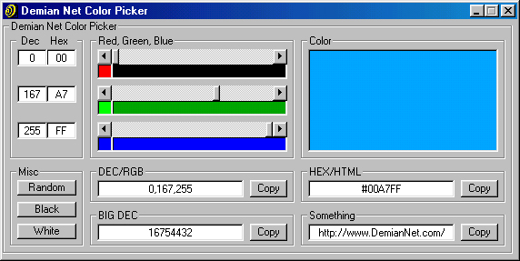



## Amazing Color Chooser

### Description

Choose you color using 3 scroll bars, Red, Green, Blue (RGB). Get Single Hex or Decimal, Full Hex/HTML or Decimal/RGB & Complete Decimal. Saves last screen position, saves last color, prese colors (black & white) & has a random color button. Amazing.
 
### More Info
 

             |
---                |---
**Submitted On**   |2000-05-23 16:41:24
**By**             |[Max \- Demian Net](https://github.com/Planet-Source-Code/PSCIndex/blob/master/ByAuthor/max-demian-net.md)
**Level**          |Advanced
**User Rating**    |4.8 (24 globes from 5 users)
**Compatibility**  |VB 5\.0, VB 6\.0
**Category**       |[Internet/ HTML](https://github.com/Planet-Source-Code/PSCIndex/blob/master/ByCategory/internet-html__1-34.md)
**World**          |[Visual Basic](https://github.com/Planet-Source-Code/PSCIndex/blob/master/ByWorld/visual-basic.md)
**Archive File**   |[CODE\_UPLOAD67176122000\.zip](https://github.com/Planet-Source-Code/max-demian-net-amazing-color-chooser__1-8821/archive/master.zip)

